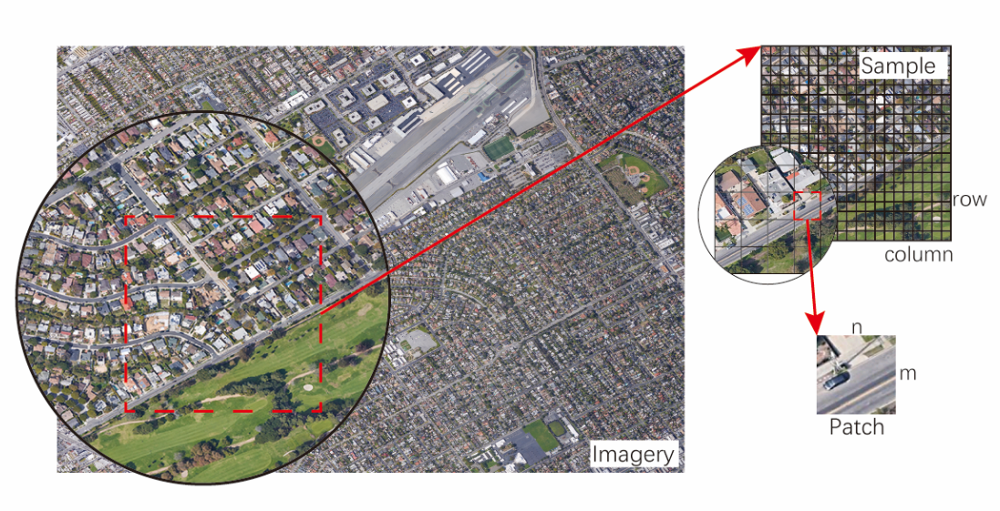

# CSU-RSISC10-DATASET
This dataset is for urban scene classification and built by Chao Tao, Weipeng Lu, Ji Qi and Hao Wang of Central South University. This dataset is composed by two levels: sample and patch.
The size of a sample is $2000\times2000$ and the size of a patch is $100\times 100$
When you use this dataset please cite this project.

## Categories
The categories and number of data in train and test dataset.
| Scene Class      | Sub\-class components                                                                    | Train | Test |
| ---------------- | ---------------------------------------------------------------------------------------- | ----- | ---- |
| Road             | Railway, highway, overpass, intersection and general road                                | 17129 | 2480 |
| Commercial       | Commercial services with complex buildings, and parking lots around commercial buildings | 6768  | 512  |
| Industrial       | Factory, warehouse                                                                       | 1588  | 506  |
| Residential      | Residential houses, terraces and small road in them                                      | 39806 | 5728 |
| Redeveloped area | Bare soil, scattered vegetation, reconstructions                                         | 530   | 22   |
| Institutional    | Education, church, scientific research, office                                           | 1948  | 386  |
| Harbor           | Sea shore, dock, ship                                                                    | 5331  | 665  |
| Water            | Sea, river, canal and lake                                                               | 12304 | 1765 |
| Open space       | Park, sports field, leisure square, beach and parking lots nearby them                   | 11587 | 2642 |
| Airport          | Airport, runway, and building grass and road in airport                                  | 3009  | 494  |
## How to use
The following code (Python) shows an example to get a patch's label by its file name:
```python
import cv2


lbl = {
    1: cv2.imread('root/LA-1-LBL_PATCH.tif', 0),
    2: cv2.imread('root/LA-2-LBL_PATCH.tif', 0),
    3: cv2.imread('root/LA-3-LBL_PATCH.tif', 0)
} # load labels

file_name = 'LA_3_002003_002017.tif'
'''
LA_3_002003_002017.tif is the file name.
LA_3 means the region code.
002003 means this patch is from a sample whose row and colunm in LA_3 is 2 and 3.
002007 means this row 2 and column 7 of this patch in the sample that it belongs to.
'''

region = int(file_name.split('_')[1])
sample_region = patch_name.split('_')[2]
patch_region = patch_name.split('_')[3][:-4]
sample_row, sample_cul = int(sample_region[:3]), int(sample_region[3:])
patch_row, patch_cul = int(patch_region[:3]), int(patch_region[3:])
pixel_row = sample_row * 20 + patch_row
pixel_cul = sample_cul * 20 + patch_cul

label_of_file = lbl[region][pixel_row, pixel_cul]
```
